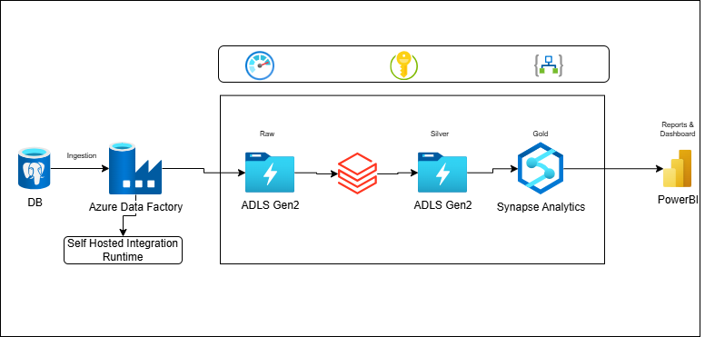
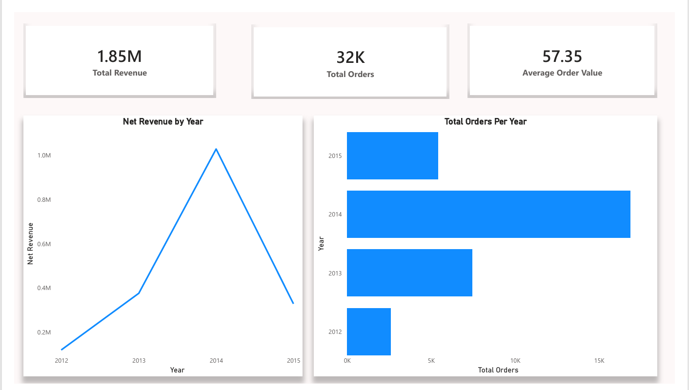
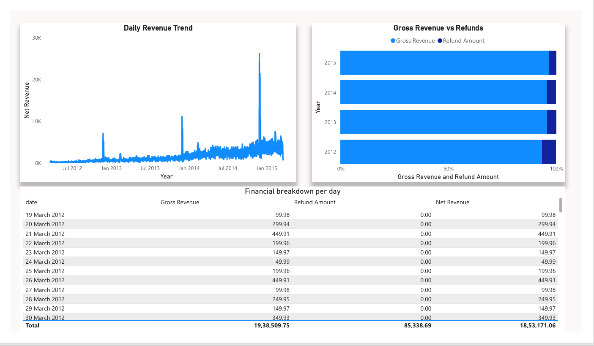

# 📊 E-Commerce Analytics Data Engineering Project
## 🔍 Project Overview

This project demonstrates an end-to-end data engineering pipeline built on an e-commerce dataset, covering data ingestion, transformation, modeling, and analytics. The goal is to transform raw operational data into analytics-ready tables that support business insights such as revenue growth, marketing performance, and customer behavior.

The dataset simulates real-world e-commerce operations, including website traffic, user sessions, orders, products, and refunds, making it ideal for practicing modern data engineering workflows.

[Dataset](https://mavenanalytics.io/data-playground/toy-store-e-commerce-database)

## Project Architecture

[Project Setup & Theory](./docs/setup.md)

**Reports**

[pbix_format](./docs/report/ecom_reports.pbix)

[pdf_format](./docs/report/ecom_reports.pdf)

**Report Summary**
1. 2015 has dip in revenue as compare to 2014.
2. Similar trend can be seen in 2015 also in orders.
3. December 1st had best revenue growth.

## Tech Stack

1. Azure Data Factory
2. Python
3. SQL
4. PowerBI
5. Azure Synapse Analytics
6. Azure Databricks